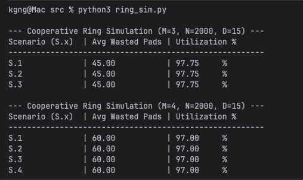

## 1. 4-Party Asynchronous Communication with Perfect Secrecy based on Cooperative Global Ring Shifting

## 2. Introduction

Click here to view the [document](KujuluvaGanesh_Then_Davila-4-report.pdf)

**Team Members:** Nithesh Gurudaas Kujuluva Ganesh, Andy Then, Raffael Davila

**Task Distribution**
- Nithesh Gurudaas Kujuluva Ganesh: Tests/Documentation/Protocol
- Andy Then: Tests/Documentation/Protocol 
- Raffael Davila: Tests/Documentation/Protocol

**Choice of m**

We have chosen m = 4 for this project.

**Main Claims**

- **Utilization:** Our protocol significantly outperforms the n/m baseline. While a static split wastes 75% of the pad in S.1, our protocol achieves approx 97% utilization (wastage ~3%) across all scenarios.
- **Waste:** The maximum waste is bounded by m times d (60 pads in our test case) regardless of the usage schedule.
- **Computational Complexity:** O(1) per simulation tick. Each move status evaluation requires only constant-time modular arithmetic and a hash-set lookup.
- **Amortized Message Latency:** In scenarios with high contention or large "dead" zones, the latency to identify a fresh pad is O(L), where L is the contiguous length of previously burned pads. However, because our protocol uses Incremental Shifting, this latency is distributed across the network's idle time, ensuring that the protocol never blocks the asynchronous communication of other parties.

## 3. Informal Explanation

Our protocol treats the n-pad sequence as a circular ring. Unlike a static split where each party is confined to a fixed quadrant, our parties are "mobile" and the boundaries are flexible.

Each party maintains a local pointer and a "view" of their neighbors' positions. Because the network is asynchronous, these views are slightly delayed. To compensate, we enforce a Safety Buffer (d). No party will move within d pads of where they believe their neighbor is standing.

**The "Cooperative" Innovation:**

When a party needs to move but encounters territory already "burned" (used) by a previous sender, they perform a Drift. They advance their pointer without encrypting. Similarly, if a party has no data to send but is blocking an active sender behind them, they "yield" by jumping forward. This allows active senders to "push" silent parties around the ring, reclaiming unused space and ensuring that pads are only wasted at the final "clinch" point where all m safety buffers meet.

## 4. Pseudocode

The protocol logic is defined by the following state machine executed every clock tick t:

**Algorithm: Move Selection**

```
FUNCTION get_move_status(party_id):
    neighbor = (party_id % m) + 1
    neighbor_view = view_of_others[neighbor]

    gap = (neighbor_view - my_index) MOD n
    next_index = (my_index + 1) MOD n

    IF gap > d:
        IF next_index NOT IN burned_set:
            RETURN ("DATA", next_index)
        ELSE:
            RETURN ("DRIFT", next_index)
    ELSE:
        RETURN ("BLOCKED", NULL)
```

**Algorithm: Main Execution Loop**

```
WHILE simulation_is_active:
    TICK network (deliver pending broadcasts)

    FOR EACH party IN active_senders:
        status, target = get_move_status(party)
        IF status == "DATA":
            encrypt_message(target)
            burned_set.ADD(target)
            my_index = target
            BROADCAST(target)
        ELSE IF status == "DRIFT":
            my_index = target
            BROADCAST(target)

    FOR EACH party IN silent_parties:
        status, target = get_move_status(party)
        IF status == "DRIFT":
            my_index = target
            BROADCAST(target)
```

## 5. Proof Intuition

Please see the [pdf](KujuluvaGanesh_Then_Davila-4-report.pdf) For a detailed and mathematically rigorous proof and perfect secrecy.

### 5.1 Perfect Secrecy

Secrecy is maintained by the **Global Burned Set Invariant**. Since every party checks `next_index NOT IN burned_set` before an encryption event, it is mathematically impossible for the same index i to be used for XOR operations by two different parties or for two different messages.

### 5.2 Collision Avoidance (d-Invariant)

Let Pos_A(t) be the actual position of Party A and View_B(A, t) be Party B's view of A. Because the network delay is <= d, Pos_A(t) >= View_B(A, t). By enforcing Gap > d, Party B ensures that even if Party A has moved forward d steps without Bob knowing, their actual positions still do not overlap.

## 6. Testing

The ring_sim.py file contains a test to run the simulation 50 times per scenario and calculate the average number of wasted pads.
Scenarios include both 3 party and 4 party rings, with variable number of senders between 1 and M (3 or 4).

```commandline
python3 ring_sim.py
```

Results of the program would be grouped according to M (Number of parties involved), then split by X (number of active senders)



We have also implemented multiple unit test cases which can be run with the command:
```commandline
pytest -q
```

The above command could throw an error in case of a Python version mismatch. In such a case, the below command should work:
```commandline
python3 -m pytest -q
```

To test the ring simulation in different scenarios, you can use the run_scenario function, and call it with the following commands:
- N : Number of Pads
- M : Number of Parties involved
- D : Number of undelivered messages/network latency
- X : Number of "Active Parties" or parties that are allowed to send messages

Testing scenarios include tests to:

1. Verify that the gap calculation handles the ring wrap-around correctly.
2. Verify that messages are only delivered after a tick and not instantly.
3. Ensure the 'data' status is never granted for a burned index.
4. Run a full scenario and assert that no security exceptions are raised during execution.
5. Test latency impact on protocol performance 
6. Test protocol performance with large population
7. Testing invariants and determinism

## 7. Comparisons with other algorithms

1. The static split algorithm splits the pads into 4 parts, and when one party exhausts all their OTPs, they would request a new set of OTPs. This results in 75% wastage.
2. A two-sided countdown algorithm was discussed early on, where party 1 counts up from 0 to N/2, party 2 counts down from N/2 to 0; vice versa for parties 3 and 4. This however results in ~50% wastage.
3. Divide the pad sequence into overlapping segments with a round-robin priority system and look-ahead buffering, which resulted in 66% wastage.
